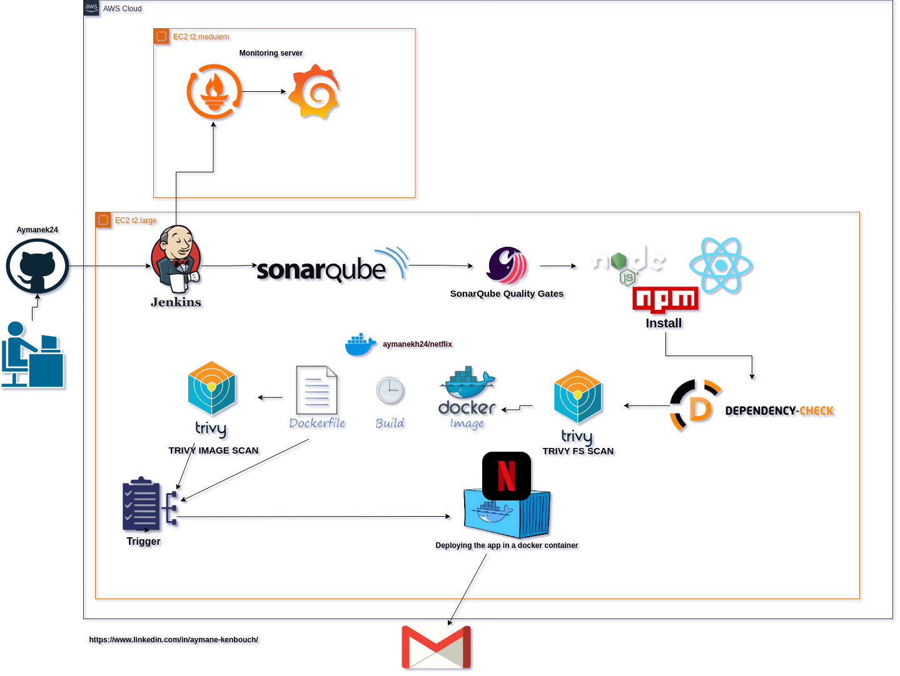
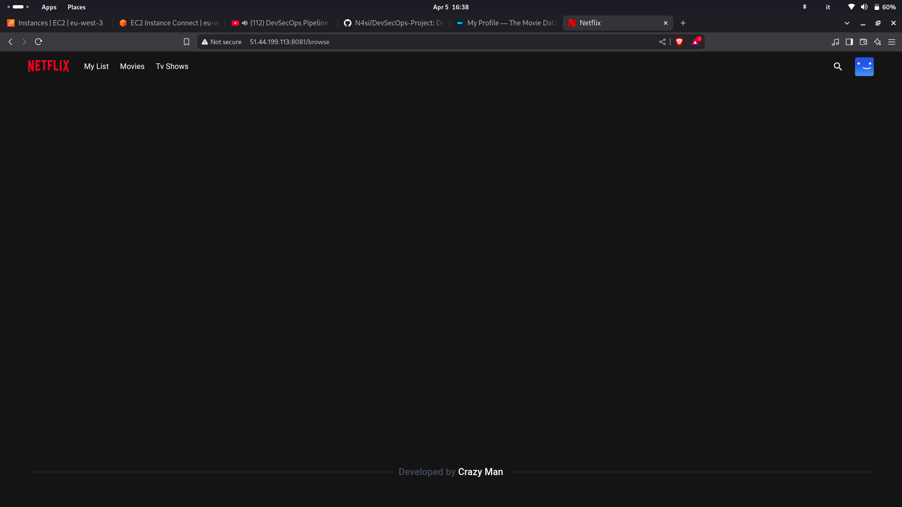
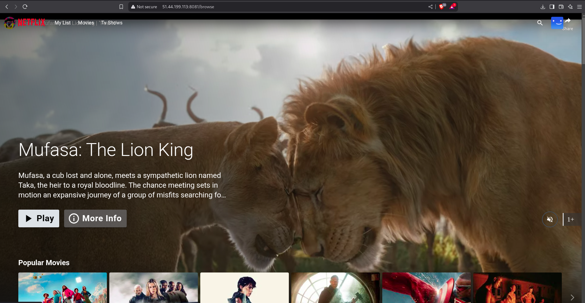
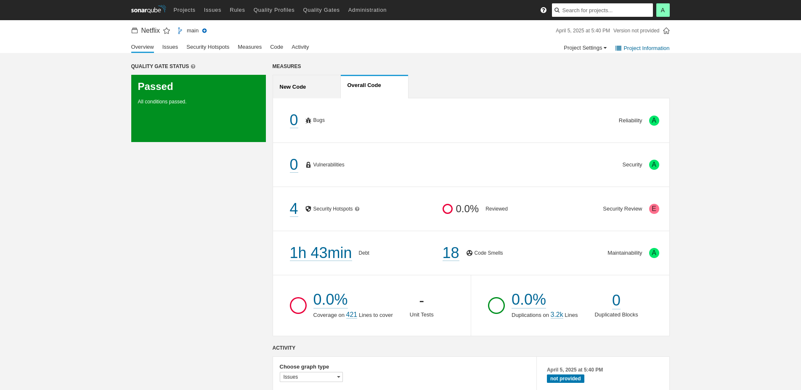
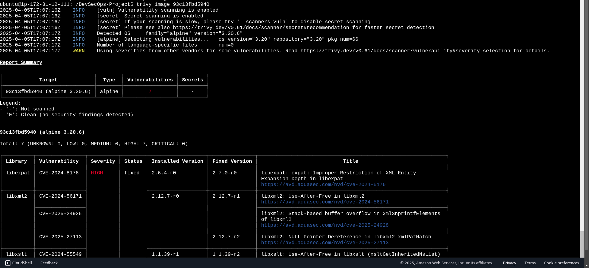
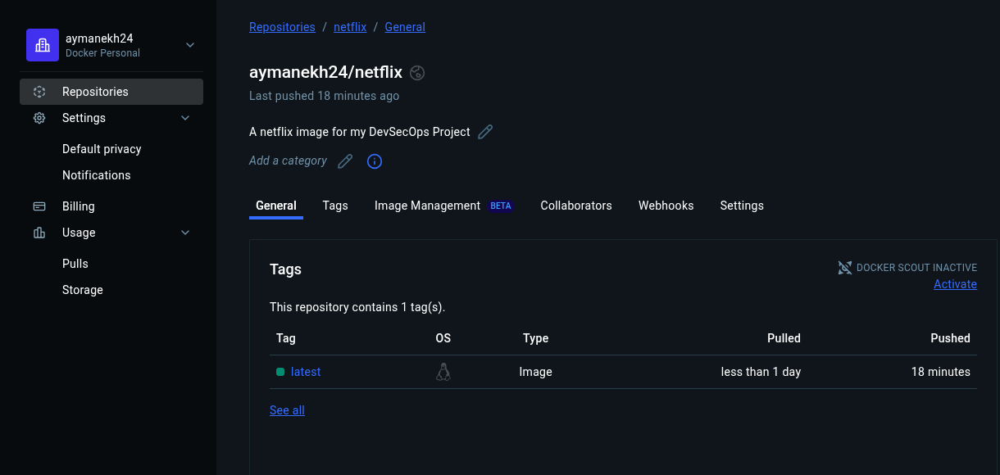
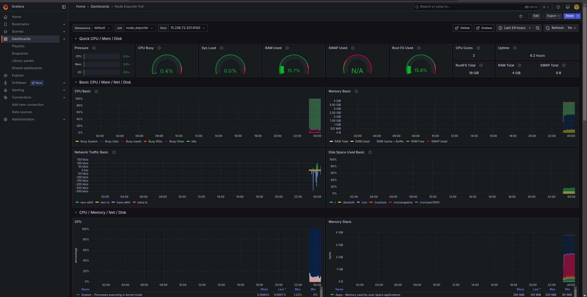
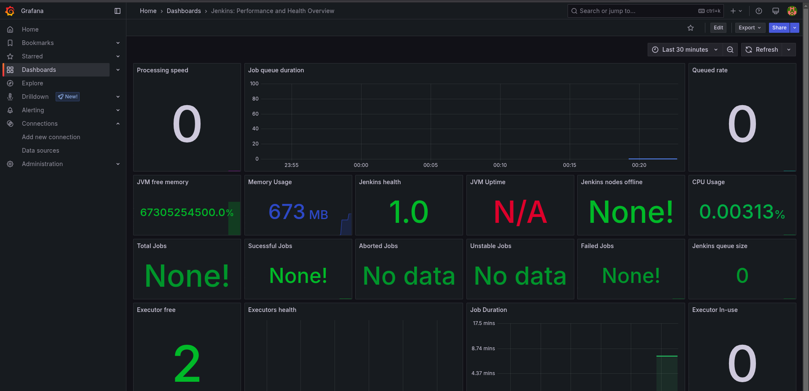

<div align="center">

</div>


<br />
<div align="center">
  
</div>

</br>

<div align="center">
  
</div>

#  Deploying Netflix Clone on Cloud using Jenkins - DevSecOps Project

---

 I Used two EC2 Instances T2Large and T2Meduime in this project, and i installed tools on theme like Jenkins, Grafana, Docker, SonarQube, Prometheuse and Trivy, you can always go the proffessional website of any tool and then read the guides and install 
 NB : the OS environnement is Ubuntu 22.02 .


## Phase 1: Initial Setup and Deployment - The Dev Step

###  Launch EC2 (Ubuntu 22.04) t2.Large

- Provision an EC2 instance on AWS.
- Allocate Elastic IPv4 for this instance and attach it to it
- Connect via SSH or via the aws console.

###  Clone the Code
from : 
```bash
git clone https://github.com/N4si/DevSecOps-Project.git
```
###  Install Docker & Run the App

```bash
sudo apt-get install docker.io -y
sudo usermod -aG docker $USER
newgrp docker
sudo chmod 777 /var/run/docker.sock
```

**Build and run:**


```bash
docker build -t netflix .
docker run -d --name netflix -p 8081:80 netflix:latest
```

on the browser do `http://<EC2_PUBLIC_IP>:8081/`

Make sure the security groupe of this instance allows this port from the allocated ipv4 for it, if it didn't work change the browser, else the network you using is blocking the access so you may need a vpn in this case.


<div align="center">
  
</div>

###  Get TMDB API Key

Create an account at [TMDB](https://www.themoviedb.org/), and get your own key


```bash
docker build --build-arg TMDB_V3_API_KEY=<your-api-key> -t netflix .
```

<div align="center">
  
</div>

---

##  Phase 2: Security

###  Install SonarQube
i'ill chose just running a docker container

```bash
docker run -d --name sonar -p 9000:9000 sonarqube:lts-community
```
Access at: `http://<EC2_PUBLIC_IP>:9000` (default credentials: admin / admin)
<div align="center">
  
</div>


###  Install Trivy

Go see proffessional website

**Scan image:**

```bash
trivy image <imageid>
```

<div align="center">
  
</div>


---

##  Phase 3: CI/CD Setup with Jenkins

###  Install Jenkins
Go see proffessional website, just follw the instruction and don't forget java version >=17

Access Jenkins at: `http://<EC2_PUBLIC_IP>:8080`

---

## 🔌 Jenkins Plugin Installation

install this plugins : 

- Eclipse Temurin Installer  
- SonarQube Scanner  
- NodeJs Plugin  
- Email Extension Plugin  
- Docker  
- Docker Commons  
- Docker Pipeline  
- Docker API  
- docker-build-step  
- OWASP Dependency-Check  


##  Jenkins Configuration

###  Global Tool Configuration

- Install:
  - JDK 17
  - NodeJS 16
  - SonarQube Scanner (e.g. `sonar-scanner`)
  - OWASP Dependency Check (e.g. `DP-Check`)

### Credentials

- Add:
  - SonarQube Token (Secret Text → ID: `Sonar-token`)
  - DockerHub Credentials (Secret Text → ID: `docker`)


##  Jenkinsfile (CI/CD Pipeline)

```groovy
pipeline {
    agent any
    tools {
        jdk 'jdk17'
        nodejs 'node16'
    }
    environment {
        SCANNER_HOME = tool 'sonar-scanner'
    }
    stages {
        stage('Clean Workspace') {
            steps {
                cleanWs()
            }
        }
        stage('Checkout from Git') {
            steps {
                git branch: 'main', url: 'https://github.com/N4si/DevSecOps-Project.git'
            }
        }
        stage("Sonarqube Analysis") {
            steps {
                withSonarQubeEnv('sonar-server') {
                    sh '''$SCANNER_HOME/bin/sonar-scanner -Dsonar.projectName=Netflix                     -Dsonar.projectKey=Netflix'''
                }
            }
        }
        stage("Quality Gate") {
            steps {
                script {
                    waitForQualityGate abortPipeline: false, credentialsId: 'Sonar-token'
                }
            }
        }
        stage('Install Dependencies') {
            steps {
                sh "npm install"
            }
        }
        stage('OWASP FS SCAN') {
            steps {
                dependencyCheck additionalArguments: '--scan ./ --disableYarnAudit --disableNodeAudit', odcInstallation: 'DP-Check'
                dependencyCheckPublisher pattern: '**/dependency-check-report.xml'
            }
        }
        stage('TRIVY FS SCAN') {
            steps {
                sh "trivy fs . > trivyfs.txt"
            }
        }
        stage("Docker Build & Push") {
            steps {
                script {
                    withDockerRegistry(credentialsId: 'docker', toolName: 'docker') {
                        sh "docker build --build-arg TMDB_V3_API_KEY=<yourapikey> -t netflix ."
                        sh "docker tag netflix aymanekh24/netflix:latest"
                        sh "docker push aymanekh24/netflix:latest"
                    }
                }
            }
        }
        stage("TRIVY Image SCAN") {
            steps {
                sh "trivy image aymanekh24/netflix:latest > trivyimage.txt"
            }
        }
        stage('Deploy to Container') {
            steps {
                sh 'docker run -d --name netflix -p 8081:80 aymanekh24/netflix:latest'
            }
        }
    }
}
```

<div align="center">
 
 The Docker image was successfully pushed to the Docker Hub registry. 

</div>


## You can see log outpout and if you had a docker Errors take this is solution: 

**If Docker login fails inside Jenkins pipeline:**

```bash
sudo su
udo usermod -aG docker jenkins
sudo systemctl restart jenkins
# Then re-run the Jenkins pipeline
```

# Monitoring & Notification Setup

 ##  Monitoring

 ### Grafana, Node Exporter, Prometheus

In this phase, we set up a complete monitoring stack to keep track of system health and CI/CD pipeline performance. We use Prometheus to collect and store metrics from different sources. It runs as a background service and is configured to monitor both the server and Jenkins.

To gather system-level metrics like CPU, memory, and disk usage, we install Node Exporter on the server. Prometheus then scrapes these metrics at regular intervals.

For visualization, we use Grafana, a widely-used tool for creating real-time dashboards. It connects to Prometheus and presents the collected data in a clear and interactive format.

<div align="center">
  
</div>
<div align="center">
  
</div>


 ## Phase 5: Notification

Jenkins Notifications : 
You go first and turn your eamil into 2FA in settings and you go create a password foe an app you name netflix in gmail for example.

in jenkins system, you configure settings of email and email extended with `smtp.gmail.com`  in the server name , and the rest you know it's easy.

then you test you should receive an email with test in it.

Go to settings of your piplibe and add post action  with your email in it, it's all here.